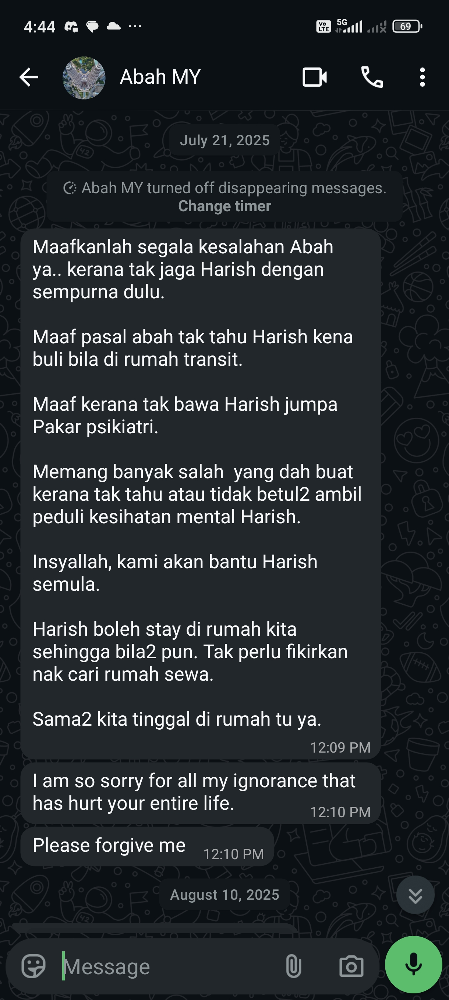
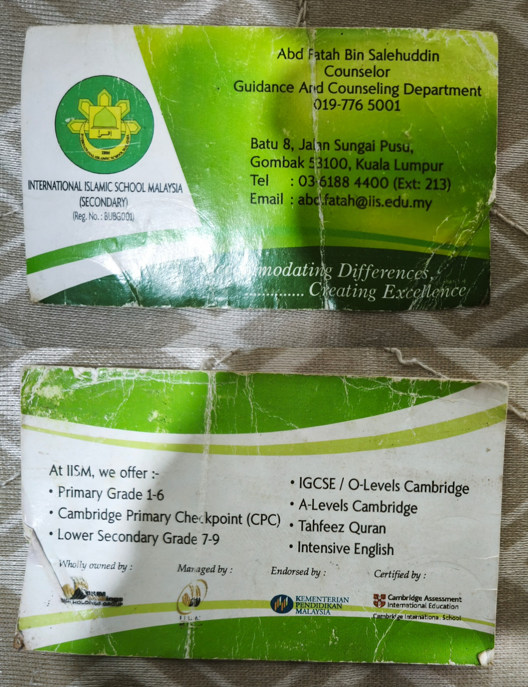

# [Why Did This Library Was Created In The First Place](../WhyDidThisLibraryWasCreatedInTheFirstPlace.md)

> Section 3: Evidence
 
## Evidence Due To My Mental Illness Treatment Delay By My Parents

### Admission Of Guilt By My Parents

### First Diary Record Of Maladaptive Daydreaming During A-Levels

* The diary name is Lily.

### Whatsapp Messages For Initial Delay In A-Levels

### The School Counselor Business Card

* You can verify age based on how worn out the card is. It is quite suprising why I still have this in my wallet for over all these years. I thank my younger selves for this!

### Grades Over The Years (IGCSE, A-Levels, Bachelor Degree)

* Notice how the grades gets worse over the years.

### Public Healthcare Medical Card For First Time Mental Illness Treatment In Malaysia

* Notice that this is years since I was first sent to the school university counselor. This means that my parents have ample time to re-evaluate their decision as everything about my life goes to shit.

## Evidence That Disproves The Severity Of Stigma

### JPJ Policy On Mental Illnesses For Driving License

#### Official Policies

* [Medical Examination Standard For Vocational Driving License (2011)](https://www.jpj.gov.my/wp-content/uploads/2022/11/MED-EXAMINATION-STANDARDS.pdf)

Note: Notice that these are for vocational driving license, not a personal one. Hence, the rules are likely more relaxed for personal driving license. If you read the policies further, you will notice that the revocation is limited to a subset of mental illnesses, but even then it can be restored if the person is receiving treatment.

#### News

* ["Pesakit mental masih boleh dibenarkan memandu - MMHA (2024)"](https://www.astroawani.com/berita-malaysia/pesakit-mental-masih-boleh-dibenarkan-memandu-mmha-491435)

* ["JPJ perlu batal lesen pemandu OKU mental jika disahkan KKM (2025)"](https://www.bharian.com.my/berita/nasional/2025/01/1352448/jpj-perlu-batal-lesen-pemandu-oku-mental-jika-disahkan-kkm)
